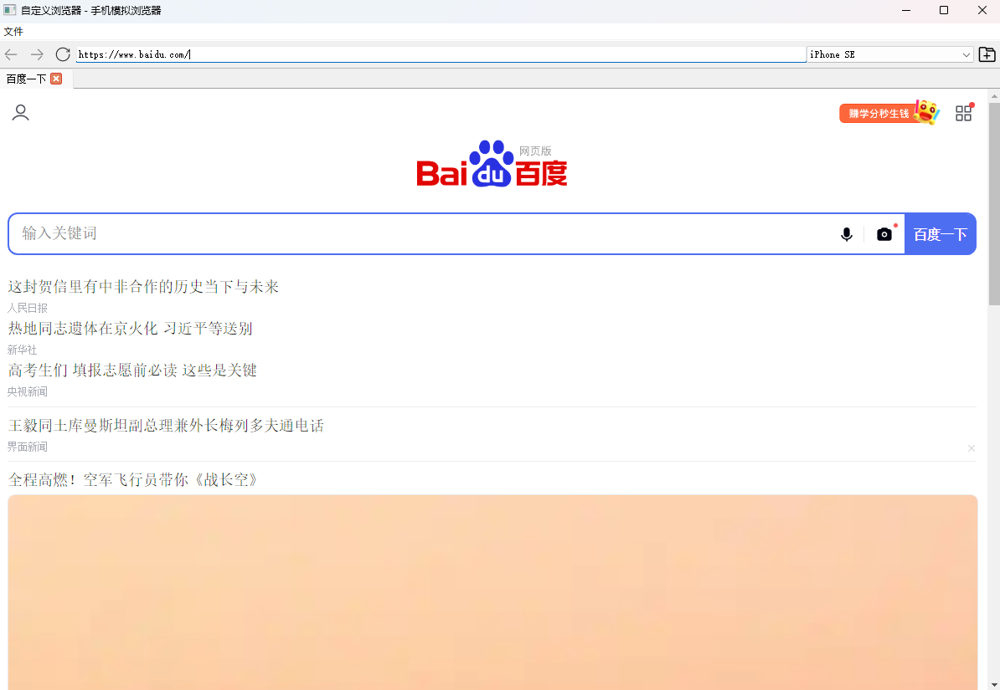

# 自定义简易浏览器

一个基于 PyQt5 和 QWebEngine 的自定义简易浏览器，主要用于移动端页面开发测试，支持 User-Agent 切换、多标签页浏览和 Chrome 风格的开发者工具。



## 功能特性

- **多标签页浏览**: 支持新建、关闭多个标签页
- **导航功能**: 前进、后退、刷新、停止加载
- **URL 地址栏**: 支持输入网址并响应回车键
- **User-Agent 切换**: 默认使用经典的 iPhone (375px)，支持切换多种设备和浏览器的 User-Agent
  - iPhone 系列 (15 Pro Max, 14 Pro 等)
  - Android 设备 (Samsung Galaxy S24 Ultra 等)
  - 品牌手机 (华为、小米、OPPO、vivo)
  - 特殊浏览器标识 (夸克、百度、UC、微信)
  - 桌面浏览器 (Chrome、Safari、Firefox、Edge)
- **Chrome 开发者工具**: 完整的 Chrome DevTools 支持，包括 Console、Network、Elements 等
- **端口访问支持**: 支持访问指定端口的本地服务（如 localhost:3000）
- **静默模式**: JavaScript 错误和警告不会输出到终端，只在开发者工具中显示

## 安装要求

- Python 3.6+
- PyQt5
- PyQtWebEngine

## 安装步骤

1. 克隆或下载项目代码：

```bash
git clone https://github.com/ccpopy/simulated-browser.git
cd simulated-browser
```

2. 创建虚拟环境（可选）

```bash
# Windows
python -m venv venv
venv\Scripts\activate

# macOS/Linux
python3 -m venv venv
source venv/bin/activate
```

3. 安装依赖

```bash
pip install -r requirements.txt
```

## 运行方法

```bash
python main.py
```

运行后终端会显示远程调试端口信息，但不会显示 JavaScript 错误，保持终端清洁。

## 使用说明

### 基本操作

1. **浏览网页**: 在地址栏输入网址，按回车键访问
2. **新建标签页**: 点击工具栏最右侧的"+"按钮或使用快捷键 Ctrl+T
3. **切换 User-Agent**: 从下拉菜单选择不同的设备/浏览器标识（默认为 iPhone 375px）
4. **查看开发者工具**: 按 F12 键或从"开发者"菜单打开 Chrome DevTools

### 快捷键

- `Ctrl+T`: 新建标签页
- `F12`: 打开/关闭开发者工具
- `Alt+←`: 后退
- `Alt+→`: 前进
- `F5`: 刷新页面
- `Esc`: 停止加载

### 开发调试

1. 访问本地开发服务器：直接在地址栏输入 `localhost:9222`

## 项目结构

```
simple_browser/
├── main.py              # 主程序入口
├── browser.py           # 浏览器主窗口类
├── browser_tab.py       # 浏览器标签页类
├── user_agents.py       # User-Agent配置
├── requirements.txt     # 项目依赖
├── README.md           # 项目说明
└── icons/              # 图标目录
    ├── back.svg        # 后退按钮图标
    ├── forward.svg     # 前进按钮图标
    ├── refresh.svg     # 刷新按钮图标
    ├── stop.svg        # 停止按钮图标
    └── add.svg         # 新建标签页图标
```

## 注意事项

- 切换 User-Agent 后，当前页面会自动重新加载
- 开发者工具是独立窗口，可以自由调整大小和位置
- 如果图标文件不存在，程序会使用系统默认图标
- 默认 User-Agent 是经典的 iPhone (375px 宽度)，适合移动端开发

## 未来调整方向(~~有空再说~~)

- 添加书签功能
- 历史记录管理
- 下载管理器
- 自定义 User-Agent 编辑功能
- 页面截图功能
- 响应式设计预览（不同设备尺寸）
